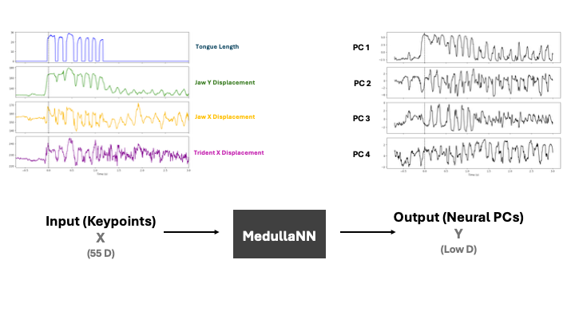
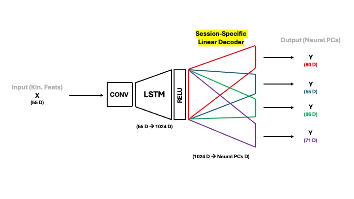
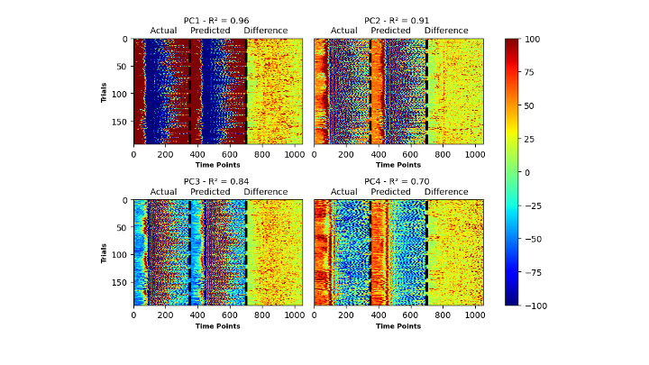
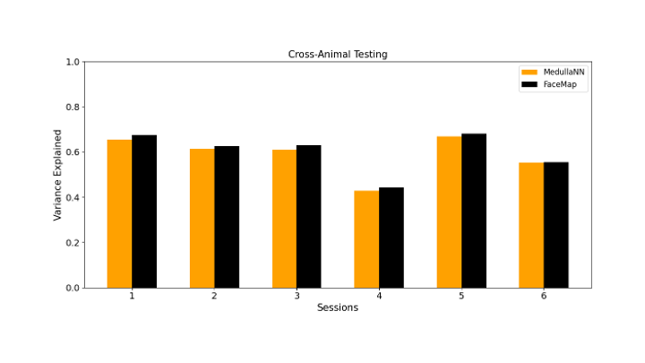

# 🧠 MedullaNN

**MedullaNN** is an LSTM-based deep learning framework designed to **predict neural population dynamics in the medulla** from **orofacial kinematics** in mice. By analyzing facial movement trajectories (e.g., jaw, tongue, whiskers), MedullaNN estimates low-dimensional neural activity — offering a powerful tool for neuroscientists to infer medullary dynamics without invasive recordings.

---

## 🔍 What It Does

MedullaNN takes as input sequential **kinematic keypoints** from mouse facial movements and outputs **principal components (PCs)** of neural activity from the medulla. This approach enables non-invasive inference of single trial neural population dynamics, which are often difficult or impossible to record directly due to the medulla's deep brain location.

---

## 🏗️ Model Architecture

The model architecture consists of:

- A **Spatio-temporal filter** that learns 
- A **LSTM encoder** that processes temporal keypoint trajectories and learns a rich, high-dimensional latent representation of movement.
- A **session-specific linear decoder** that maps the latent representation to the predicted neural principal components.

This design allows **cross-session** and **cross-animal inference** by decoupling the general movement representation (shared across conditions and animals) from session-specific decoding. This flexibility is crucial in neuroscience, where variations in recording setups, behavioral context, and anatomical differences between animals create major barriers to model generalization.

---

## 🔁 What is an LSTM?

**LSTM (Long Short-Term Memory)** networks are a class of recurrent neural networks (RNNs) that are especially effective at modeling **sequential data**. Unlike standard RNNs, LSTMs include memory cells that can retain information over long time periods, making them ideal for capturing complex **temporal patterns** in behavior.

In MedullaNN, the LSTM captures the **dynamic evolution of facial movements**, enabling the model to anticipate and reconstruct corresponding changes in neural activity over time.

---

## 🌡️ Output Example

These heatmaps show the predicted **the first four PCs** for each trial. Crucially, MedullaNN captures **trial-by-trial variance** in neural dynamics rather than relying on trial-averaged responses. This granularity allows researchers to investigate how specific movement patterns relate to moment-to-moment fluctuations in medullary activity.

---

## 🚀 Performance

While **MedullaNN** has not yet outperformed the current state-of-the-art model, **Facemap**, preliminary results show promising trial-level predictions of medullary neural dynamics. Importantly, these results were obtained **prior to hyperparameter optimization**, using **arbitrarily chosen hyperparameters**.

**Facemap** is a powerful behavioral modeling framework that leverages orofacial tracking to infer neural activity across the brain:

> **Syeda, A., Zhong, L., Tung, R., Long, W., Pachitariu, M.\*, & Stringer, C.\*** (2024).  
> *Facemap: a framework for modeling neural activity based on orofacial tracking.*  
> *Nature Neuroscience, 27(1), 187–195.*

Notably, **FaceMap was not originally designed to support cross-session or cross-animal inference**, which are central challenges addressed by MedullaNN. To enable a **fair model comparison**, we **adapted FaceMap’s architecture** by adding **session-specific decoders**, allowing it to match MedullaNN’s evaluation setting.

Although FaceMap currently achieves higher performance, **MedullaNN offers greater architectural flexibility** through its use of LSTM-based temporal encoding and modular decoding. This may ultimately provide stronger generalization across experimental conditions and subjects — especially in decoding neural dynamics from hard-to-record regions like the medulla.

---

## 🧠 Neuroscience Significance

MedullaNN tackles several major challenges in systems neuroscience:

- **Non-invasive inference** of deep brain activity.
- **Single trial predictions** that preserve neural variability.
- **Generalization across sessions and subjects**, enabled by a shared encoder and session-specific decoder.
- A new framework to link facial kinematics to brainstem dynamics, guiding both **experimental designs** and **neural decoding studies**.

---

## 📂 Repository Structure

MedullaNN/
├── model/ # MedullaNN model
├── facemap/ # Facemap model with session-specific decoder
├── data/ # An example session's data
├── figures/ # Model figures and outputs
├── train.py # Training script
├── evaluate.py # Evaluation metrics
├── README.md # Project documentation

---

## 📫 Contact

**Omar El Sayed**  
PhD Candidate | BME | Boston University
Economo & DePasquale Labs  
GitHub: [@oelsayed10](https://github.com/oelsayed10)  
Email: oelsayed@bu.edu  

Feel free to reach out for collaborations, questions, or feedback!

---

